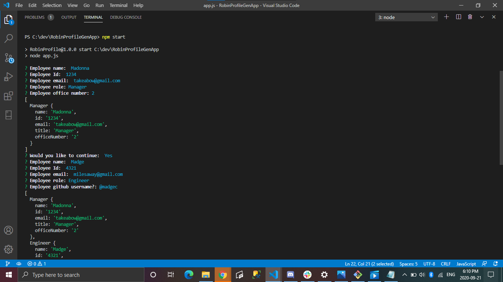
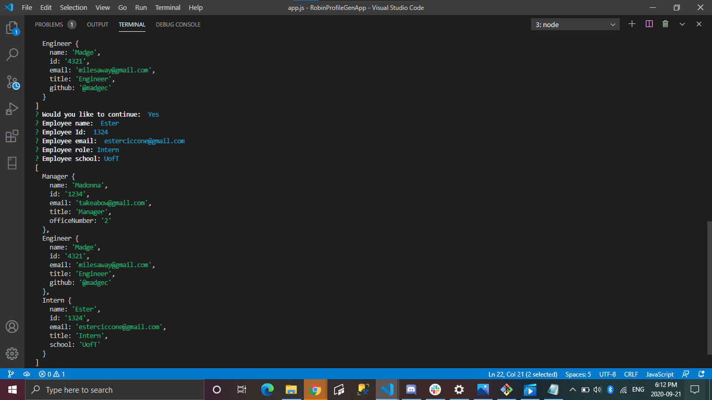
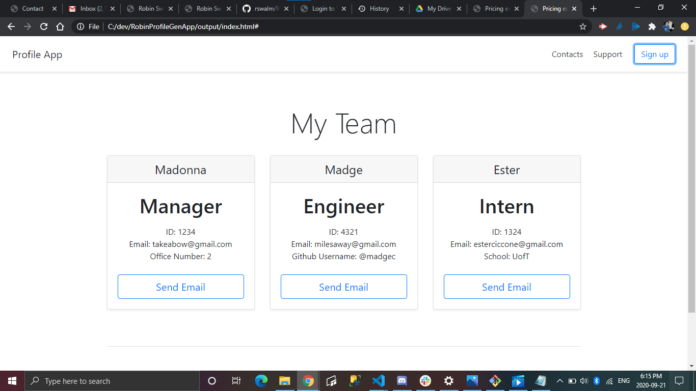

Team Generator

This Team Profile Generator is a command line application that prompts the user for information about the team manager and then information about the team members. The user can input any number of team members, and they may be a mix of engineers and interns. When the user has completed building the team, they will then click on an HTML file that displays in the browser a nicely formatted team roster based on the information provided by the user.

Application Features:
* Generates a webpage that displays teams basic info.
* Quick access to emails and github profiles
* Displays summaries for each person
* Inputs any number of employees
* May be a mix of engineers and interns.

